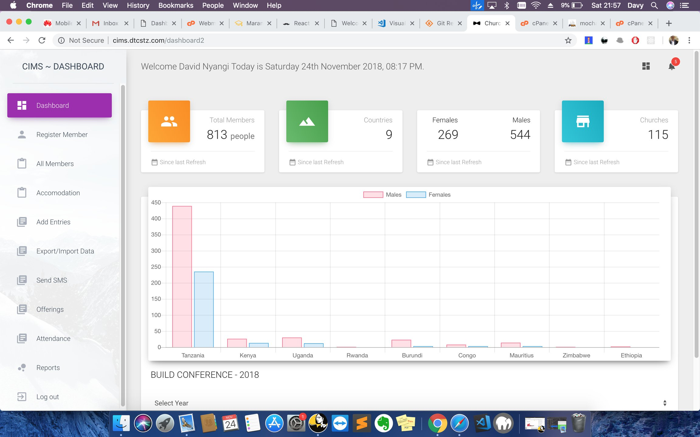
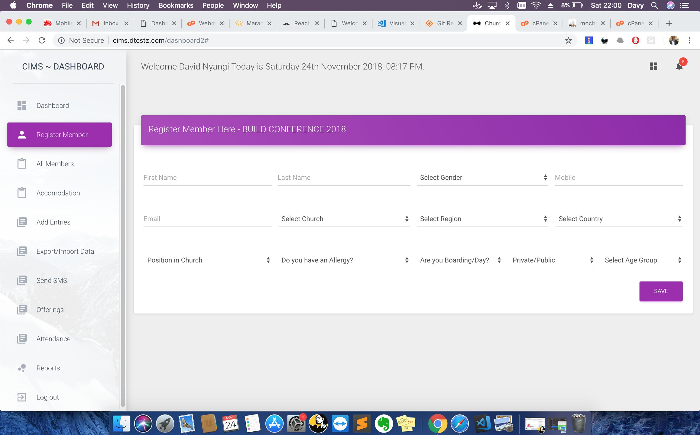
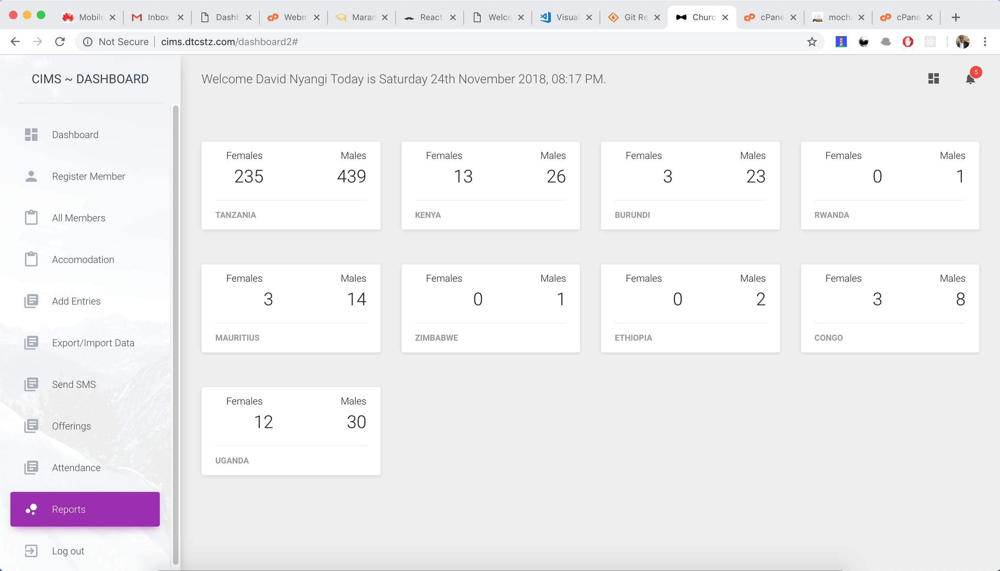

# cms
Church Information Management System

A simple church information management system (built with Laravel + MySQL) where you can manage members' information, analyze offerings, download registered members in excel formats and view visual (graphical) reports

Design credit to Creative Tim

Features:  
Member Registration 
Offerings Record Management 
Graphical Reports 
Export registered members to Excel Formats 
Update other parameters 

Sourcerer.io Hall-of-fame widget

